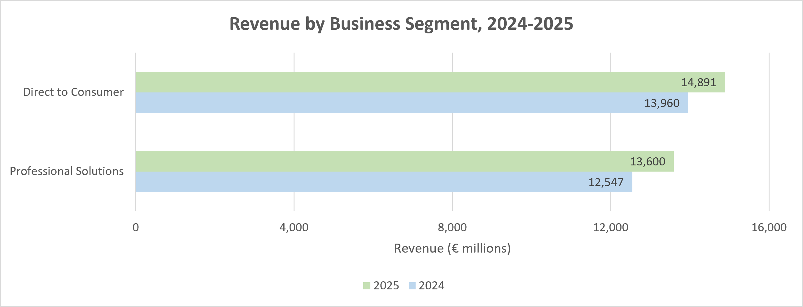
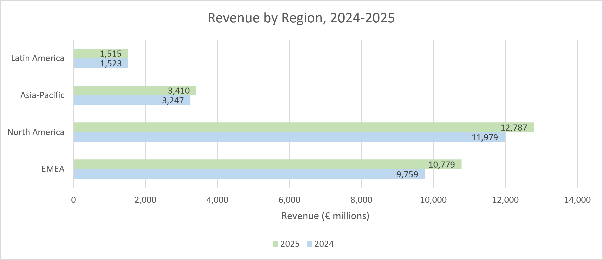
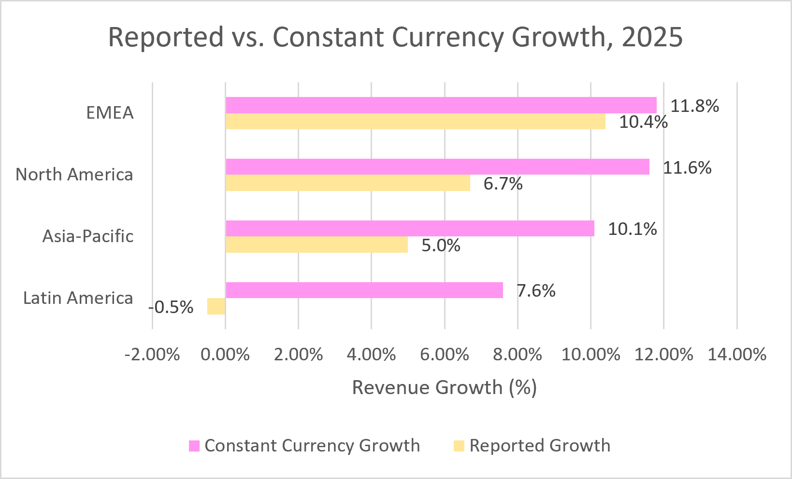
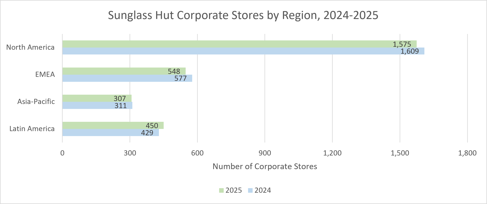
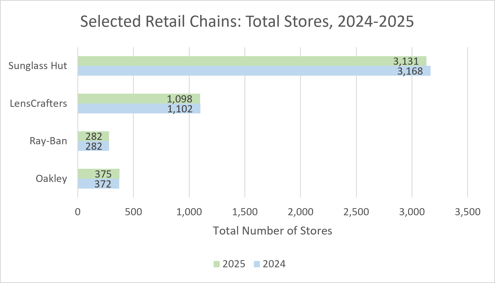

# EssilorLuxottica Retail Performance & Sunglass Hut Store Footprint
## 2024-2025 Analysis

I previously worked at Sunglass Hut as a sales associate, and it made me interested in creating a retail analysis project using real data from the company. I used EssilorLuxottica's annual reports from 2024 and 2025 to compare revenue across business segments, examine currency effects, and track changes in store counts.

I used PostgreSQL for the analysis and Excel for the charts.

[View the Excel workbook](EssilorLuxottica_Analysis.xlsx)

## What I looked into
- Which business segment grew faster?
- Which region contributed most to the increase in revenue?
- How did reported growth compare with constant currency growth?
- How did Sunglass Hut's corporate store counts change by region?
- How did total store counts change across four selected retail chains?

## Findings

### Revenue by Business Segment

Professional Solutions revenue grew 8.39%, Direct to Consumer did 6.67%. Direct to Consumer remained to be the larger segment, with €14,891 million in revenue in 2025.

### Revenue by Region

EMEA (Europe, the Middle East, and Africa) added €1,020 million in revenue, which accounted for approx. 51.4% of the company’s total revenue increase. North America remained to be the largest region by revenue.

### Currency Effects

Latin America’s revenue declined 0.5% as reported, but grew 7.6% at constant exchange rates. The 8.1 percentage point gap shows how currency movements affected the reported result.

Constant currency growth compares revenue using consistent exchange rates. The gap is measured in percentage points, not euros.

### Sunglass Hut Corporate Stores

Sunglass Hut’s corporate store count went down from 2,926 to 2,880 (net decrease of 46 stores). Latin America was the only region with an increase, with an addition of 21 stores. North America had the largest decrease, at 34 stores.

### Selected Retail Chains

Sunglass Hut had the most stores among the four selected chains in 2025, with 3,131 locations. Its total decreased by 37 stores. Oakley increased by 3, Ray-Ban was unchanged, and LensCrafters decreased by 4.

These totals include corporate, franchised, and licensed stores. Sunglass Hut’s franchised and licensed stores increased by 9, which partly offset the decrease in corporate stores.

## Details on the Analysis

I took the revenue and store count data from the reports and entered it into PostgreSQL. I used SQL joins, aggregations, common table expressions, and window functions to compare the years, calculate growth rates, and measure contributions to growth.

I checked the number of rows in each table and made sure the regional revenue totals matched the reports. I also checked that Sunglass Hut’s corporate store counts across the regions added up to its reported total. Then I exported the results as CSV files and created the charts in Excel.

## Project Files

| File | Contents |
|---|---|
| [SQL](SQL/) | Database setup, analysis queries, and row-count checks |
| [Results](Results/) | Five CSV files exported from the analysis |
| [Charts](Charts/) | Five charts exported from Excel |
| [Excel workbook](EssilorLuxottica_Analysis.xlsx) | Summary, results tables, and charts |

## Running the SQL

Use PostgreSQL. I worked with PostgreSQL 18 and pgAdmin 4.

1. Create a new empty database.
2. Run SQL/01_setup.sql once to create and fill the five tables.
3. Run the queries in SQL/02_segment_analysis.sql, SQL/03_regional_analysis.sql, and SQL/04_store_analysis.sql.
4. Run SQL/05_data_checks.sql to check the table row counts.

Expected row counts:

| Table | Rows |
|---|---:|
| segment_revenue | 4 |
| regional_revenue | 8 |
| regional_growth_rates | 4 |
| store_footprint | 8 |
| store_ownership | 16 |

Keep in mind, the setup file is intended for a fresh database. Meaning running it again in the same database will produce errors because the tables already exist.

## Data Sources

- [2025 Universal Registration Document](https://www.essilorluxottica.com/en/cap/content/284322/): business segment revenue on page 128, regional revenue and growth rates on page 130, and store counts on page 14.
- [2024 Universal Registration Document](https://www.essilorluxottica.com/en/cap/content/247386/): store counts on page 13.
